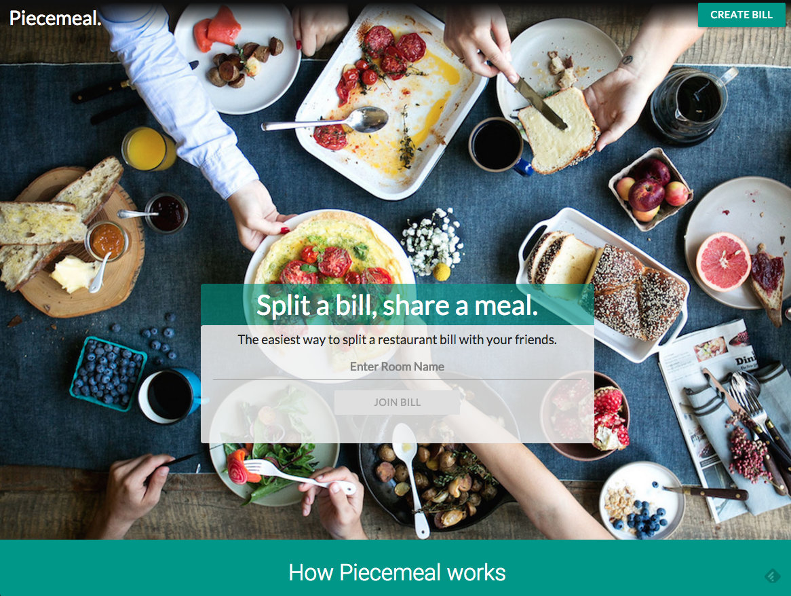
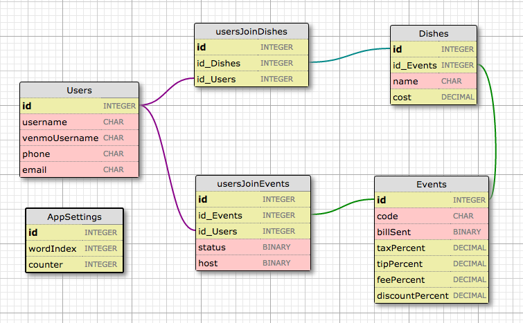
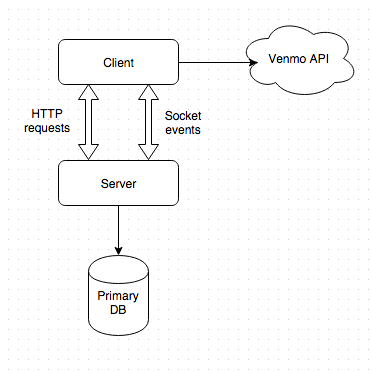

# Piecemeal.us

The easiest way to split a bill. Try it out at [piecemeal.us](http://www.piecemeal.us/).



## Team

  - __Product Owner__: Fawn Bertram [LinkedIn](https://www.linkedin.com/in/fawnbertram) -  [Github](https://github.com/Faline10)
  - __Scrum Master__: Jackson Sharf [LinkedIn](https://www.linkedin.com/in/jacksonsharf) - [Github](https://github.com/5harf)
  - __Development Team Members__: Michelle Lee [LinkedIn](https://www.linkedin.com/in/michellemhlee) - [Github](https://github.com/mi-lee)

## Table of Contents

1. [Usage](#Usage)
1. [Development](#development)
    1. [Requirements](#requirements)
    1. [Installing Dependencies](#1. Install the dependencies:)
    1. [Tasks](#tasks)
1. [Team](#team)
1. [Contributing](#contributing)

## Usage


#### Using the appplication

Piecemeal is live! You can try it out at at **[piecemeal.us](http://www.piecemeal.us/)**.


## Development

#### Requirements

- Node 4.2.x
- PostgreSQL 9.1.x

##### 1. Install the dependencies:

```
sudo npm install -g bower
npm install
bower install
```

##### 2. Setup your database locally.
1. Install [Postgres.app](http://postgresapp.com/) - full-featured PostgreSQL installation w/ `psql` CLI
2. Install [Postico](https://eggerapps.at/postico/) *_(optional)_* - PostgreSQL Client for OSX aka GUI. Double check that Postgres.app is running from your OSX toolbar. It should indicate that you are running port **5432**.
3. Use Postgres CLI to create the database:

```
psql
CREATE USER admin WITH SUPERUSER;
ALTER USER admin WITH PASSWORD 'admin';
SET ROLE admin;
CREATE DATABASE piecemeal;
```


##### 3. Start the server with either Node or with Grunt.

a. Starting using Grunt **(recommended)**:
```
grunt init
grunt start
```

This will start up the database, start the server, set up livereload and `grunt watch` to lint, run tests and create documentation as you change the files.

b. Or with a simple node command:

```
node server/server.js
```

#### 4. Further dev instructions

There is a file called 'venmoApiKeysFILL-IN.js' in the root folder. Add your developer keys from [Venmo](https://developer.venmo.com/) and rename it 'venmoApiKeys.js'.

Most problems can be solved by dropping the database. To clear it, stop the server and run:

```
psql
drop database piecemeal;
create database piecemeal;
```


## Contributing

See [CONTRIBUTING.md](CONTRIBUTING.md) for contribution guidelines.


### Roadmap

Currently in progress!

#### Database Schema




#### Data flow

#### Architecture of Piecemeal



#### Testing

We used Jasmine and Karma to test our Angular components, and used [mgMock](https://docs.angularjs.org/api/ngMock) and [angular.mock.inject](https://docs.angularjs.org/api/ngMock/function/angular.mock.inject).

To run the tests, just run:

```
karma start karma.conf.js

```


### Frequently Asked Questions


1. Why is everything in an IIFE in the client-side Angular files?

We follow John Papa's [Angular Style Guide](https://github.com/johnpapa/angular-styleguide), a comprehensive guide on syntax and structure of Angular components for greater readability and clarity.


